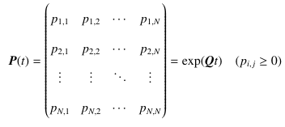
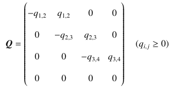
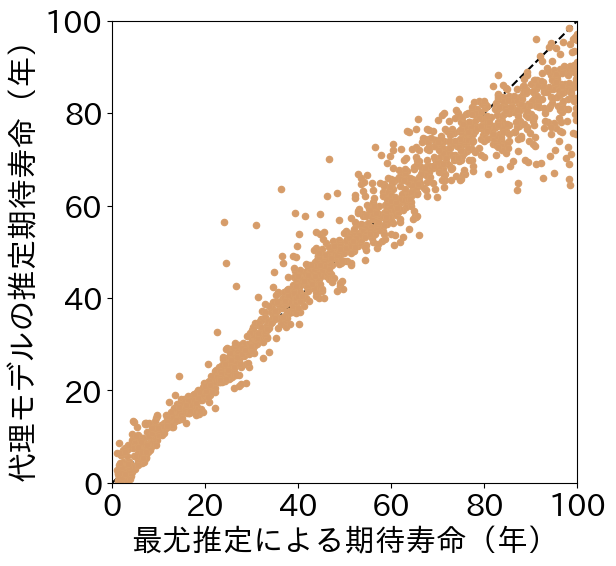
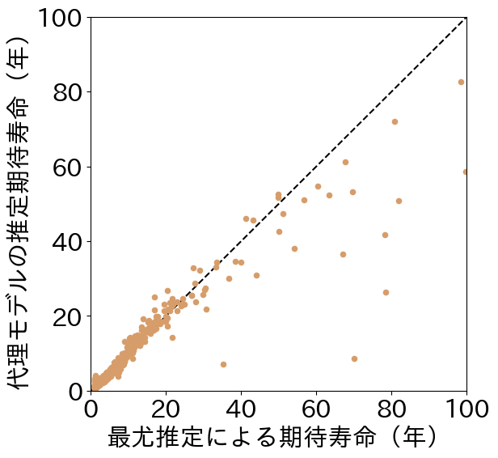
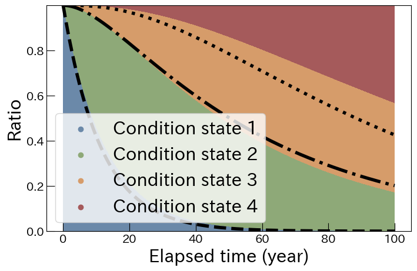
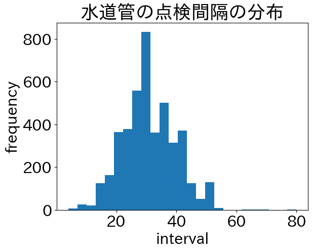
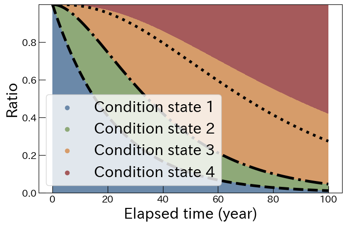

# 深層学習による連続時間マルコフ連鎖（Continuous-time Markov chains: CTMC）の最尤推定過程に関するサロゲートモデリング

整備が完了していないので随時更新いたします．
ご了承ください．

## 概要・目的
連続時間マルコフ連鎖（CTMC: Continuous-time Markov Chains）は，状態間の遷移が確率的かつ連続時間で発生する動的システムを表現するための基本的な枠組みである．特に，状態が時間とともに不可逆的に劣化するような現象（例：社会インフラの劣化，金融商品の信用格付け変化）において，CTMCは自然かつ数理的に妥当なモデルとして広く採用されている.

本リポジトリでは，CTMCの仮定の下での観測データ集合（状態遷移と経過時間のタプル）を入力とし，推移率行列（Transition rate matrix）に含まれるパラメータを直接出力する深層学習モデルを構築する．従来，これらのパラメータは尤度関数の最大化を通じて，逐次的かつ最適化的な反復計算アルゴリズムで推定されていた．しかし，これらの計算プロセスは非凸性や，初期値依存性，アルゴリズムの複雑さなどの困難を含んでいた．

そこで本リポジトリでは，サンプル集合空間を $\mathcal{X}$ ，推移率パラメータ空間を $\mathcal{Q}$ とし，それらを結ぶ写像 $ f: \mathcal{X} \to \mathcal{Q} $ をニューラルネットワークにより学習させる．この写像は，最尤推定の過程を関数近似としてサロゲートするものであり，予測モデルとしてCTMC推定を即時化・自動化することが可能となる．

この手法は，従来の推定プロセス全体をブラックボックスな近似関数で置き換え，入力から直接推定結果を得ることができる新しい推定パラダイムの一形態として位置づけられる．

## CTMCの定式化
### CTMCの定義
CTMCは高々加算無限の状態空間 $\mathcal{S} = \{1,2,3, \cdots\}$ からなる連続状態上の確率過程 $ \{s(v); 0 \leq v \leq t\} $ として定義され．任意の時刻 $t,u \geq 0$ ，任意の状態 $i,j \in \mathcal{S}$ に対して，  
$$
    P(s(t+u) = j | \{s(v), 0 \leq v \leq t \}, s(t) = i) \; = \;
    P(s(t+u) = j | s(t) = i)
$$  
で定式化される**連続時間上でのマルコフ性**が成り立つ確率過程である．  

上式で示したマルコフ性は，「ある時刻$t$で状態$i$であった時に別の時刻$t+u$で状態$j$である確率は，過去の状態の履歴 $ \{s(t); s(t) \in \mathcal{S}, t \geq 0\} $ によらず，ただ時刻$t$に状態$i$であったという事実のみに依存して決定される」ことを意味する．  

また，一般にCTMCは高々加算無限の状態空間に対して定義されるが，深層学習モデルとしての実装の容易さや実用性の観点から**有限状態空間**を仮定して差し支えない．したがって，以降は有限の状態空間 $\mathcal{S} = \{1,2,3, \cdots N\}$ について考える．  

### 推移率行列$\boldsymbol{Q}$の導入
状態間の推移は以下に示す推移率行列$\boldsymbol{Q}$によって定められる．  
  
ここで， $q_{i,j}$ は状態$i$から状態$j$への単位時間あたりの推移率であり， 微小時間 $\Delta t$ における推移確率は $q_{i,j} \Delta t$ に比例すると解釈される．  
また，対角成分 $-\sum_{i \neq j}q_{i,j}$ の絶対値の逆数が，状態$i$における**期待滞在時間**として解釈され，滞在時間はこの絶対値をパラメータに持つ指数分布に従うことが知られている．  

推移率行列 $\boldsymbol{Q}$ は以下の行列指数関数によって，任意の時間経過$t$での推移確率行列 $\boldsymbol{P}(t)$ に変換できる．
  
この式で $p_{i,j}$ は，「時刻 $t = 0$ で状態 $i$ であったときに，時間 $t$ 経過後に状態 $j$ に遷移している確率」を表す．

### 観測データと尤度関数
本リポジトリでは，CTMCに従う現象に対して，以下の形式の観測データが得られると仮定する：  

$$
    x_k = (i_k, j_k, t_k), \; \boldsymbol{X} = \{x_k | k \in \{1,2, \cdots ,K \} \}
$$

ここで， $i_k$ は以前の観測状態， $j_k$ は次の観測状態， $t_k$ は2つの観測の時間間隔を意味し，これらを合わせて観測データ $\boldsymbol{x}$ とし， $\boldsymbol{x}$ からなる観測データ集合を $\boldsymbol{X}$ ， $K$ は集合 \boldsymbol{X}$ 要素数（観測データの総数）を表す．  

CTMCの推移率行列 $\boldsymbol{Q}$ 対して，任意の時間間隔 $t$ に対応する推移確率行列 $P$ が行列指数関数によって得られるため，観測データ集合に基づく尤度関数は以下の定式化のように定義される．  

$$
    \mathcal{L}(\boldsymbol{Q}|\boldsymbol{X}) = \prod_{k=1}^K p(t_k)_{i_k,j_k}
$$  

この式において， p(t_k)_{i_k,j_k}$ は，CTMCの推移率行列 $\boldsymbol{Q}$ から，得られた時間間隔 $t_k$ ごとに算出される推移確率行列 $\boldsymbol{P}(t)$ の $(i_k,j_k)$ 成分にあたる．  
一般にCTMCにおける最尤推定では，この尤度関数を以下の負の対数尤度関数に変換して，最小化問題として反復計算による最適化アルゴリズムを用いてパラメータ推定を行う．  

$$
    \mathcal{L}'(\boldsymbol{Q}|\boldsymbol{X}) = -\sum_{k=1}^K \log(p(t_k)_{i_k,j_k})
$$

### 問題設定
本リポジトリでは，上述したCTMCを社会インフラの統計的劣化モデルとして応用することを考える．  
この時，得られる観測データはそれぞれ以下のように解釈される:
-  $i_k$ ：以前の点検での状態（劣化度）
-  $j_k$ ：次の点検での状態（劣化度）
-  $t_k$ ：二つの点検の間隔（経過時間）

ここで状態（劣化度）は数値が大きいほど状態が悪化していることを示すものとする．  
また，本リポジトリではCTMCの枠組みを社会インフラの統計的劣化モデルとして適用するにあたり，以下の仮定をおく：
- 劣化度は4段階で表される（数値が大きいほど状態悪化）
- 微小時間あたりに進行しうるのは 1 段階の劣化のみ（近接状態へのみ遷移可能）
- 自然回復（劣化度の改善）はしない

この仮定のもとでは，求めるべき推移率行列は以下のような形になる：  
   

これより，求めるべきパラメータは $(q_{1,2},q_{2,3},q_{3,4})$ となる．  
以降では，この問題を最尤推定によって解くプロセスを代理する深層学習モデルのアーキテクチャについて検討を行う．

## モデルのアーキテクチャについて
### Deep Sets
本リポジトリでは，深層学習モデルのアーキテクチャとしてDeep Setsを採用した．  
Deep Setsは集合データの処理に特化した構造をもつニューラルネットワーク（NN）であり，入力集合$\boldsymbol{X}$に対し，順序に対して同変（equivariant）または不変（invariant）な出力を返すことができる．加えて，入力集合の要素数に柔軟に対応でき，かつ要素間の独立性を仮定した設計が可能である．  
今回のような問題設定では，社会インフラの点検データの規模が対称によって異なること，観測データ（点検台帳など）における要素の並び順が出力結果に影響を与えるべきでないことから，これらの条件を自然に満たせるアーキテクチャとしてDeep Setsを採用した．  

Deep Setsは以下のようにして定式化される:   

ここで， $\phi(\cdot)$ は入力集合$\boldsymbol{X}$の各要素に作用するNNである．これは， $\boldsymbol{X}$ の各要素の特徴抽出に対応する*．これを $\boldsymbol{X}$ の全要素に対して行い，得られた特徴ベクトルの平均集約を行う．この集約後の特徴量は，入力集合の特徴量として解釈される．  

 $\rho(\cdot)$ は集約操作によって得られた集合の特徴量を，最終的なタスクの出力（今回であれば $\boldsymbol{q}$ ）にマッピングする関数である．  
本リポジトリでは $\phi(\cdot), \rho(\cdot)$ もに，全結合の順伝播NNを用いた．  
なお，出力層にはsoftplus関数を適用することで $\boldsymbol{q}$ の各要素の非負制約を満足した．  

以上の要素ごとの特徴抽出と順不変性をもった集約操作によって，要素数に柔軟かつ，順序に影響を受けない形での入力集合の特徴抽出を可能にし，最尤推定におけるこれらの要件を自然に満たせるため，Deep Setsを採用した．

＊ここの集約操作は集合の要素に対する順不変性を持つ操作（例：最大値取得，総和，平均）であればDeep Setsとしての枠組みが成立するが，ここでは最尤推定というタスク特性を考慮し，入力集合の要素数に比例したスケールの肥大が望ましくないため，平均集約を採用した．

### 損失関数
最尤推定というタスクは機械学習の枠組みでは回帰問題の一種として考えることができる．  
回帰問題に用いる損失関数としては以下の式で定式化されるような最小二乗誤差（MSE）を用いるのが一般的である．  

ここで， $\boldsymbol{\hat{q}}$ は目標出力となるCTMCの推移率行列の成分ベクトルで， $\boldsymbol{\tilde{q}}$ は深層学習モデルの出力である．  
しかし，本モデルの訓練プロセスでは以下に示す指数分布に対する1-Wasserstein距離に基づく，損失関数を使用した．  

本リポジトリの問題設定では，推定パラメータが推移率行列の対角成分の絶対値そのものであるため，この逆数は各劣化度の期待滞在時間として解釈される．そのため，この損失関数は単にモデルの出力パラメータを比較するのではなく，モデルが推定したCTMCの確率的な挙動がどれだけ外れているかを表現する損失関数と解釈することが可能である．  

以下に実際にこの損失関数とMSEとで訓練過程における損失評価の違いを見てみよう．  
| 真のパラメータ | 期待寿命（真値） | 推定パラメータ | 推定寿命     |
|----------------|------------------|----------------|--------------|
| 0.8            | 1.25             | 0.9            | 1.11...      |
| 0.1            | 10               | 0.2            | 5.0          |

これはいずれの行も，「推定パラメータが真の値より0.1大きかった状況」を想定している．  
MSEを用いた損失関数を用いた場合，どちらのケースにおいても損失は推定パラメータの誤差を0.1として評価する．しかし，期待寿命の観点でから見ると，0.1 の差がもたらす影響は大きく異なる．特に，真のパラメータが 0.1 のケースでは，期待寿命に対して推定結果が大きくずれており，**モデルの推定が CTMC の挙動を著しく誤って再現していることが分かる**．  

したがって，本研究で用いた損失関数では，「推定パラメータがどれだけ合っているか」ではなく，「モデルがどれだけ現象の挙動を正確に再現できているか」という観点から誤差を評価できる．これは，**CTMC を用いた現象モデリングにおいて本質的に重要な評価軸である**．  

深層学習モデルは，高速な関数近似を可能にする一方で，出力にある程度の誤差を伴うことが避けられない．  
ゆえに，最終的な損失は「タスクとしての意味（現象再現性）」に沿って設計すべきである．このような観点から，本リポジトリでは上記の損失関数を選定した．

## 訓練データ生成フロー
本リポジトリでは以下のプロセスで訓練データを生成した．
1. 推移率行列 $Q$ を期待寿命を一様分布として乱数生成
2. 対称ディリクレ分布から $i_k$ の比率を決定
3.  $i_k$ を2.で定めた比率で乱数生成， $t_k$ を $(0,5)$ の一様分布から生成
4. $Q$ に従うCTMCの枠組みで， $i_k$ ， $t_k$ から $j_k$ を生成
5. 3.~4.を30,000回繰り返し， $Q$ 従うサンプルセットを作成
6. 1.~5.を50,000回繰り返し，多様な $Q$ に対するデータセットを生成

本来は5.の後に最尤推定を生成されたサンプルセットに対して行い，得られた $Q$ を真の値とするべきだが，計算コストが大きくなるため，サンプル数を増やすことで，最尤推定量と生成時の値の一致を図った．  

また，以下の2種のデータ生成パターンを比較対象として採用し，モデル精度への影響を評価した：

- **モデル1**：**各劣化度の期待寿命**を $(1, 100)$ の一様分布から生成し，$Q$作成，$t_k$ を一様分布 $(0, 5)$ からサンプリング  
- **モデル2**： $\boldsymbol{Q}$ の**各パラメータ**を $(0.01, 1)$ は同様に一様分布から生成，$t_k$ を対数正規分布からサンプリング  

以下では，それぞれを「モデル1」「モデル2」と呼称し，両者の予測性能を比較する．

## 結果の可視化
本リポジトリでは，以下の二つの結果の可視化を行う
- 訓練データ同様の仮想データに対する適用
- 実際の点検データに対する適用

仮想データについては，それぞれのモデルについて訓練データと同様のプロセスで作成したものを用いる．  
実データについてはそれぞれのモデルで良い精度が出せた実際のインフラ点検データでの最尤推定との比較を行う．

### 仮想データに対する推定
#### モデル1
モデル1の仮想データに対する推定結果は以下のとおり．

この図は，訓練データと同様のプロセスで作成されたデータに対してモデルが推論した結果（縦軸）と，データ生成時に使用したパラメータから計算された期待寿命（横軸）をプロットしたものである．  
厳密には，横軸の値は最尤推定結果ではなく，仮想データを生成した際の真のパラメータに対応する期待寿命であるが，サンプル数が十分に多いため，便宜上「最尤推定による期待寿命」として扱っている．

図中には，500個のデータセットに対して 3 状態分の期待寿命をそれぞれプロットしており，合計 1500 点のプロットを含む．

この結果を見ると，全体としてモデルの出力は真の期待寿命とよく一致しており，**代理モデルとして十分な精度で最尤推定の傾向を捉えている**ことがわかる．

一方で，**期待寿命が長い領域（右上）では，モデル出力が過小評価される傾向がある**．  
この原因としては，訓練データにおいて最大でも期待寿命 100 年程度までしか分布していないため，学習が不安定になったと考えられる．

#### モデル2
モデル2の仮想データに対する推定結果は以下のとおり．

この図は， $\boldsymbol{Q}$ の各要素を一様分布から生成したうえで，$t_k$を対数正規分布に従ってサンプリングしたデータで訓練したモデルが，同様の生成プロセスに基づくデータに対して期待寿命を推定した結果をプロットしたものである．

図を見ると，**長寿命領域にプロットがほとんど存在せず，短寿命領域に集中している**ことがわかる．  
これは， $\boldsymbol{Q}$ の各要素を一様分布からサンプリングした際に，その逆数（＝期待滞在時間）が非線形に広がるため，**実際の期待寿命の分布が強く短寿命側に偏ってしまう**ことに起因する．  
結果として，期待寿命が 1～100 年にわたって取りうるにもかかわらず，実際の分布は10年未満に大きく集中している．

このようなデータの非対称性は，モデル精度にも顕著な影響を与える．  
図中では，**20年程度までの短寿命領域では高い精度が維持されている**のに対し，**それを超える領域では推定精度が急激に悪化している**．  
これは，訓練データの不均衡がモデルの汎化性能に悪影響を及ぼす典型例といえる．

一方で，**対象とする現象が短寿命（＝高劣化率）である状況に限定される場合**には，本モデルの適用は極めて有効である．  
このように，**適用範囲の制約を踏まえて導入すれば，局所的には高い性能を発揮する**ことが示された．

### 実データへの適用

今後の考察でも述べるが，今回作成したモデルはいずれも，2状態間の観測間隔が特定の分布（例：一様分布）に従うよう生成したデータを用いて訓練を行っている．  
そのため，**モデルの適用範囲はこの仮定に依存しており，異なる観測間隔分布に対する推定精度は保証されない**．

---

#### モデル1の適用例

モデル1を実際のインフラ点検データに適用した事例を示す．  
使用したのは，橋梁の RC 床版に関する点検データであり，劣化度指標のうち 4 段階を抜き出すことで，今回構築したモデルの適用前提に合わせている．

比較対象は従来の**最尤推定**であり，両者による**期待滞在時間の推定値**を以下に示す．

---

##### 点検間隔の分布（補正前）  
観測間隔 $t_k$ の分布は以下のとおり：

訓練時に用いた一様分布とは大きく異なるため，**分布を近づける補正**として，以下の処理を施した：

- 観測間隔 $ t_k $ を定数 $r$ で除する（スケーリング）  
- 推論後の期待滞在時間を $r$ 倍して元スケールに復元する  

---

##### 推定結果の比較（期待滞在時間）

| 劣化度 | 深層学習モデル | 最尤推定 |
|--------|----------------|----------|
| 1      | 10.65 年       | 9.57 年  |
| 2      | 40.34 年       | 45.37 年 |
| 3      | 58.91 年       | 31.12 年 |

劣化度1および2については近い結果が得られている一方で，**劣化度3においてはモデル出力が大きく乖離しており，課題が残る**ことが確認された．

---

##### 劣化進展の推定シナリオ

以下は，$t = 0$  に全インフラが劣化度1の状態にあったと仮定し，経年による劣化度の推移を推定した結果である：

- **色付き領域**：深層学習モデルによる推定  
- **黒い破線**：最尤推定による推定

ここでも，**劣化度3の進展パターンにおける不一致**が明瞭であり，モデルの改善余地が示唆される．

#### モデル2への適用例
続いてモデル2に実データを示した事例を示す．  
使用したデータは水道管渠の点検データである．  

##### 点検間隔の分布(補正前)
水道管渠点検データの点検間隔 $t_k$ 分布は以下の通り．
  

こちらも，訓練時に使用したデータに分布の形状を近づけるため，同様の処理を行った．  

---

##### 推定結果の比較（期待滞在時間）

| 劣化度 | 深層学習モデル | 最尤推定 |
|--------|----------------|----------|
| 1      | 22.69 年       | 22.30 年 |
| 2      | 18.15 年       | 18.89 年 |
| 3      | 62.71 年       | 38.69 年 |

モデル2は，訓練時から「**長寿命領域での精度が悪化する傾向**」が確認されていたが，  
今回の実データ適用においても，**劣化度3に対応する領域で大きな乖離が確認された**．

一方で，**短寿命領域（劣化度1・2）では高い一致率が見られ，モデルの特性が実データ上でも顕著に現れた**ことが分かる．  
このことから，モデル2は**短寿命傾向のインフラに対しては有効性を持つ設計である**と解釈できる．

---

##### 劣化進展の推定シナリオ
モデル1の橋梁RC床版と同様に推定結果をもとにした劣化進展シナリオの可視化を行った．  

- **色付き領域**：深層学習モデルによる推定  
- **黒い破線**：最尤推定による推定

ここでも，**劣化度3の割合が過大に推定されている**ことが視覚的にも確認できる．  
これは，モデル2が長寿命のケースで十分な学習を行えなかったことに起因し，**この領域での精度改善が今後の課題である**と言える．  

## まとめと展望

